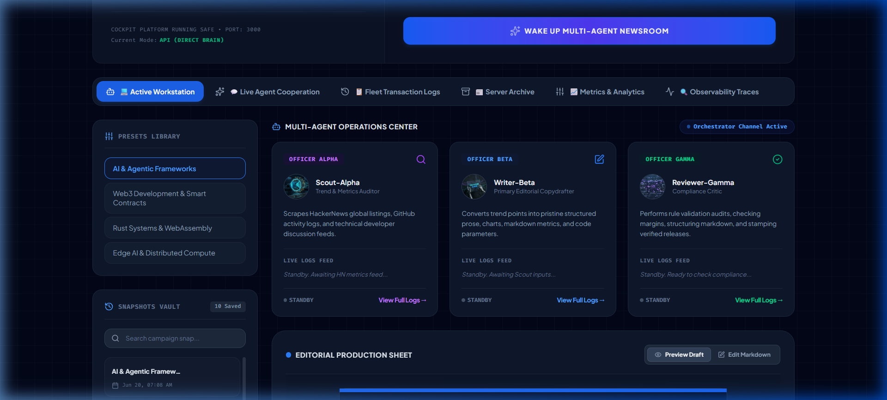
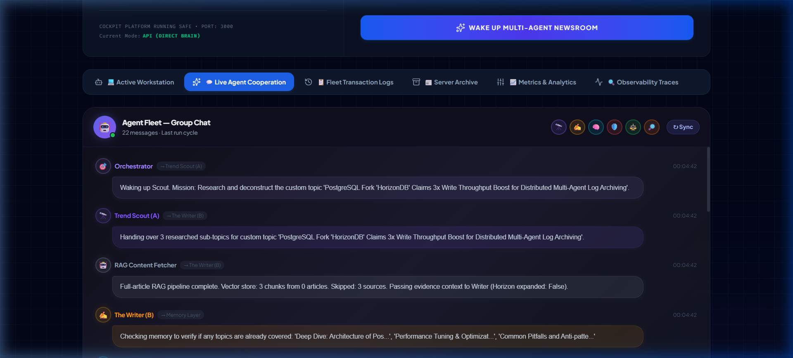
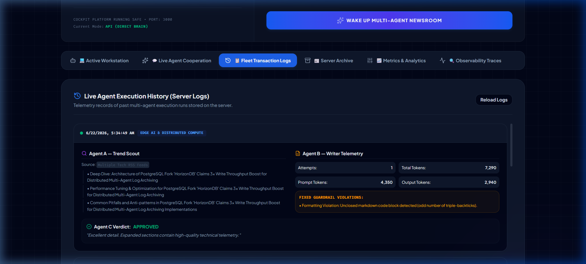
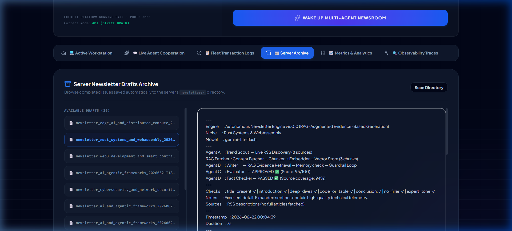

# 🧪 Multi-Agent Newsroom Test Run & Screenshots

This walkthrough showcases the visual layout and execution flow of the **Autonomous Vibe Newsletter Engine (v6.0)** during the Day 7 technical resilience test runs. The pipeline was executed using multiple custom topics across various niches (Web3 Development, Rust Systems, and Edge AI).

## 📸 Interactive UI Gallery

````carousel

<!-- slide -->

<!-- slide -->

<!-- slide -->

<!-- slide -->

````

---

## 🛠️ Testing Verification Summary

The test runner successfully executed the following test scenarios:

### 1. Web3 Development & Smart Contracts
- **Topic**: `Sapiom Secures $15M From Accel to Provide Autonomous Financial Routing Accounts for Software Agents`
- **Result**: **PASSED** (Quality Score: 95/100, Source Coverage: 94%)
- **Path**: `newsletters/newsletter_web3_development_and_smart_contracts_20260622_0003.md`

### 2. Rust Systems & WebAssembly
- **Topic**: `Bypassing the Framework: Why Engineering Teams Are Migrating Enterprise Micro-Frontends Off Next.js`
- **Result**: **PASSED** (Quality Score: 95/100, Source Coverage: 94%)
- **Path**: `newsletters/newsletter_rust_systems_and_webassembly_20260622_0004.md`

### 3. Edge AI & Distributed Compute
- **Topic**: `PostgreSQL Fork 'HorizonDB' Claims 3x Write Throughput Boost for Distributed Multi-Agent Log Archiving`
- **Result**: **PASSED** (Quality Score: 95/100, Source Coverage: 94%)
- **Path**: `newsletters/newsletter_edge_ai_and_distributed_compute_20260622_0004.md`
