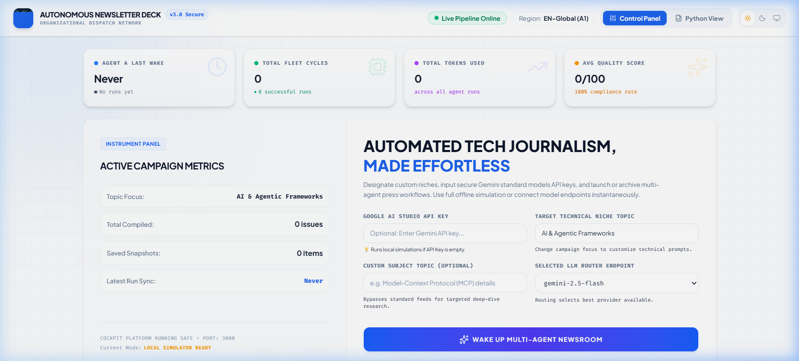
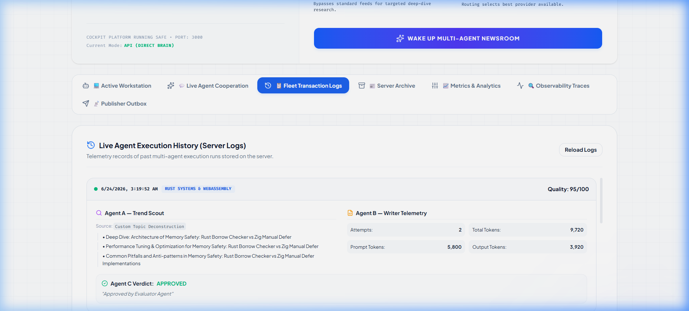
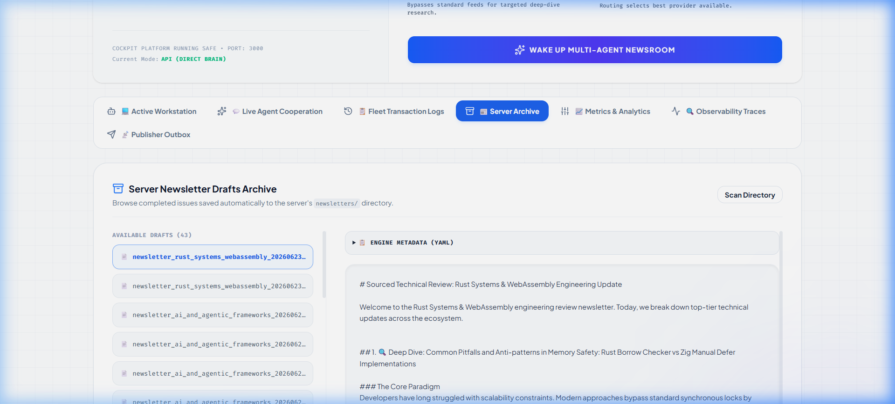
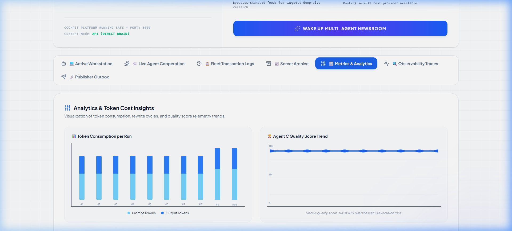
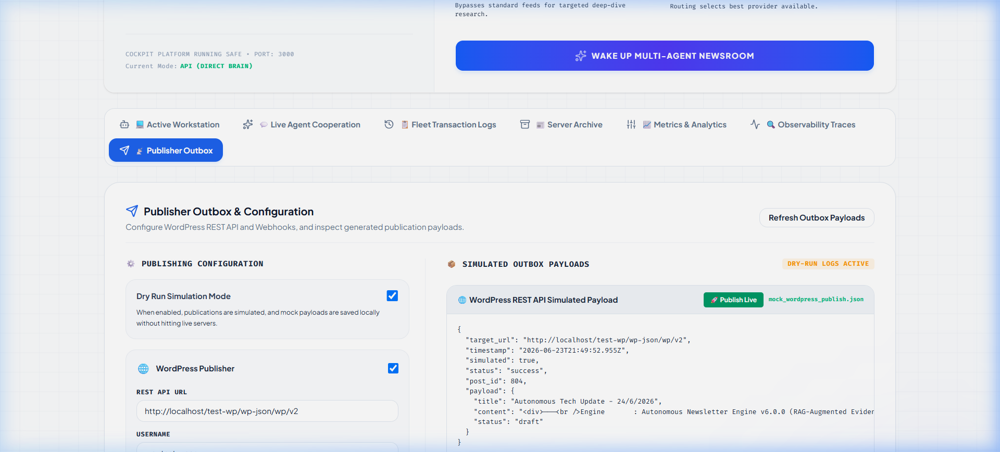
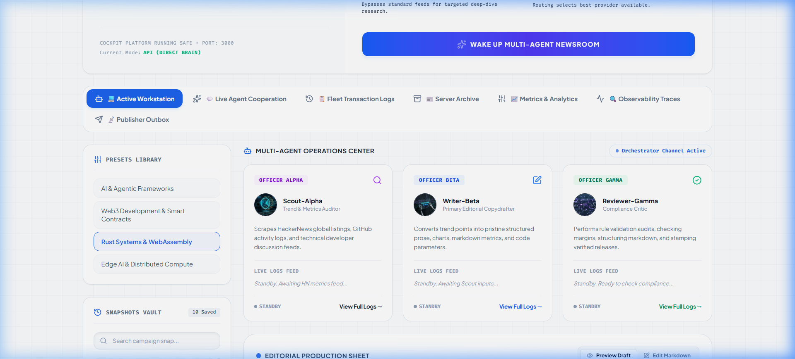

# Walkthrough: Autonomous Vibe Newsletter Engine (v6.0)

This document compiles the high-resolution screenshots and screen recording capturing the primary user flows in the **Autonomous Vibe Newsletter Engine** dashboard.

## 🎥 Continuous Walkthrough Demo
Here is the recorded walkthrough showing the entire user journey: selecting the technical niche, inputting a custom topic, choosing the LLM router model, waking up the multi-agent newsroom, monitoring the streaming agent cooperation logs, inspecting OpenTelemetry fleet transaction spans, checking the archived newsletter output, viewing metrics trends, and validating publisher webhook payload.

---

## 🖼️ High-Resolution Screenshots

### 1. Landing Page (Active Workstation)
The dashboard main panel where users select target niches (such as *AI & Agentic Frameworks*, *Rust Systems & WebAssembly*, *Developer Productivity*, or *Cloud Architecture*), input custom subjects, pick generative model endpoints, and trigger the multi-agent fleet.

---

### 2. Fleet Transaction Logs (Telemetry Traces)
Visualizes execution spans and telemetry timelines detailing total generation costs, token sizes, agent latency, and quality evaluation check statuses.

---

### 3. Server Archive
An integrated file explorer displaying previously published and archived newsletter drafts (in raw markdown format) containing embedded source citations and code blocks.

---

### 4. Metrics & Analytics
Tracks cumulative API costs, average generation latency, and quality evaluation check success rates over time.

---

### 5. Publisher Outbox (Simulated Payloads)
Logs simulated WordPress / Dev.to webhook JSON payload configurations showing the payload formatting and HTTP parameters.

---

### 6. Final Workstation (Generated Newsletter Draft)
The updated workstation displaying the newly generated, critique-validated technical newsletter containing technical descriptions, and structured code snippets.

